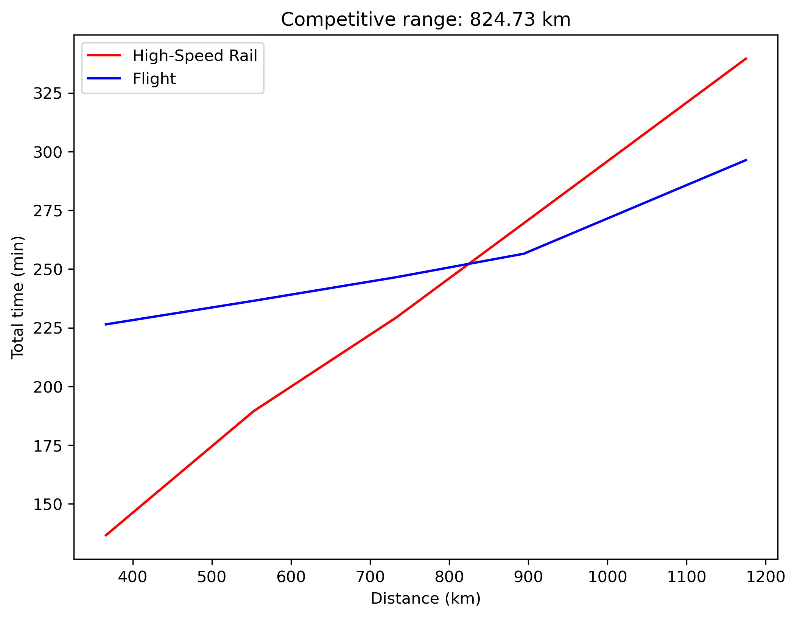
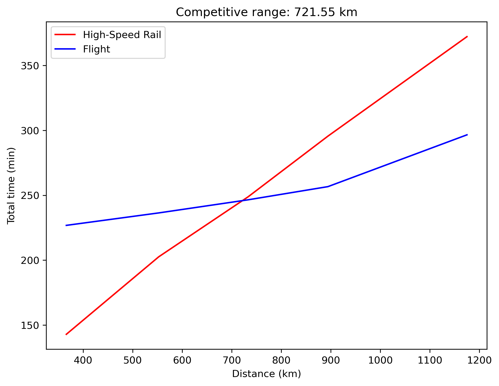
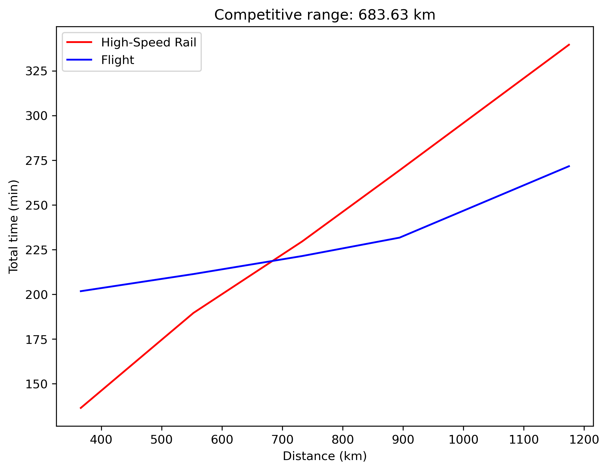
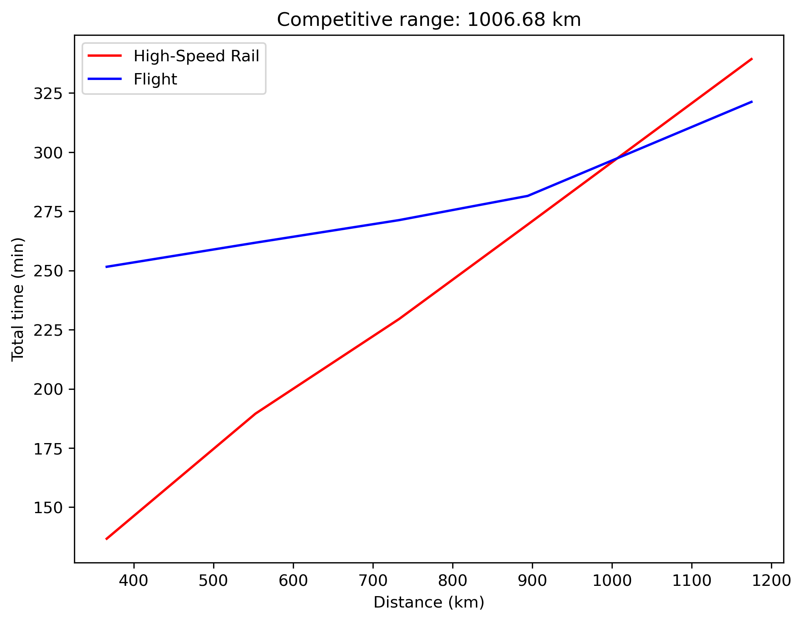
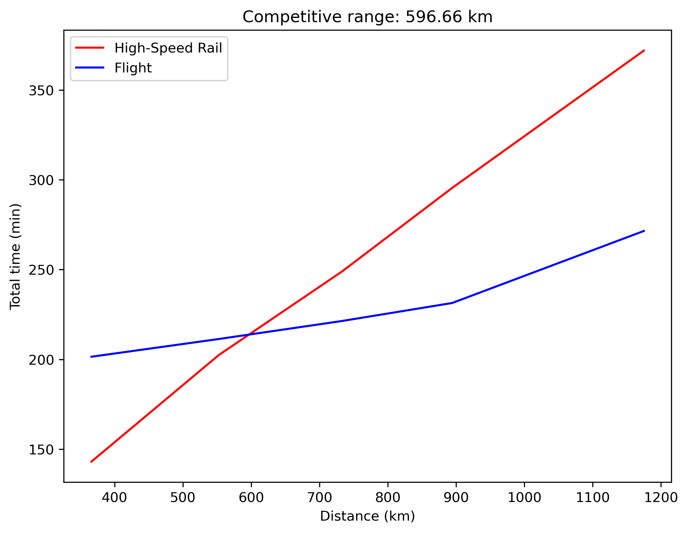

# Topic: 
    Time Efficiency Comparison of High-Speed Rail vs. Airplane

## Goal statement: 
    This project aims to compare the time efficiency of high-speed rail and airplanes over different scenarios.

## Related files:
    final_projects/
        ├── README.md                               # Introduce the project and present results
        ├── final_project.pdf                       # Final project presentation slides
        ├── final_project.ipynb                     # Include the functions and the main script used to compare the time efficiency of high-speed rail and airplanes.
        │   ├── function1: calculate_avg_total_time         # This function calculates the average total time cost. Detailed documentation is available in the script’s markdown.
        │   └── function2: draw_figure                      # This function draws a diagram showing the time cost comparison. Detailed documentation is available in the script’s markdown.
        └── figures/
            ├── case1_comparison.png                        # Current scenario
            ├── case2_comparison.png                        # With one more stop in each high-speed rail segment
            ├── case3_comparison.png                        # Shorter flight processing time (off-peak)
            ├── case4_comparison.png                        # Longer flight processing time (holiday)
            └── case5_comparison.png                        # Extreme case: one more stop in each high-speed rail segment and shorter flight processing time

## Documentation:
### Section 1: Introduction
Although airplanes travel much faster than high-speed rail, the overall travel time can sometimes be shorter for high-speed rail. This is because train stations are often more conveniently located and train procedures are much simpler. As a result, there exists a competitive distance, a range within which people are more likely to choose high-speed rail over flying. The purpose of this script is to obtain a time-efficiency comparison between airplanes and high-speed rail and to identify the competitive distance of high-speed rail under different scenarios. The comparison is made by estimating the total travel time required to go from one city to another using either high-speed rail or an airplane. The script then plots the required travel time for both modes across different distances, from which the competitive distance of high-speed rail can be determined. Finally, the script evaluates multiple scenarios to examine how the competitive distance changes under different assumptions.

### Section 2: Methodology
        We consider a high-speed rail line in Japan from Tokyo to Hakata, which is over 1000 km, to examine how changes in different scenarios affect the competitive range of high-speed rail. The total time cost consists of 4 components.
        1. Access time to Haneda Airport and Tokyo Station
            Travel demand is randomly generated at stations along the Yamanote Line, which is a circular rail system within Tokyo. The travel time between adjacent stations is approximately 2–3 minutes. For simplicity, we set it to 2 minutes in this model. The high-speed rail station is located at Tokyo Station. Passengers traveling to Haneda Airport must transfer at Hamamatsucho Station to the Tokyo Monorail. The transfer waiting time is assumed to follow a uniform distribution between 1-4 minutes, and the in-vehicle travel time on the monorail is 25 minutes.

        2. Processing time in airports and stations
            The processing time at high-speed rail stations is assumed to follow a uniform distribution between 20-30 minutes. This includes ticket inspection, passing through the gates, walking to the platform, waiting for the train, and boarding. For air travel, the processing time is assumed to follow a uniform distribution between 60-90 minutes, including baggage drop-off, check-in, security screening, walking to the gate, waiting for the airplane, and boarding.

        3. In-vehicle travel time
            The in-vehicle travel times for high-speed rail and airplanes are obtained from the timetables provided by the rail and airline companies, as shown below.
            (1). Tokyo -> Nagoya    : 366    km,  97 mins (HSR),  60 mins (Flight)
            (2). Tokyo -> Osaka     : 552.6  km, 150 mins (HSR),  70 mins (Flight)
            (3). Tokyo -> Okayama   : 732.9  km, 190 mins (HSR),  80 mins (Flight)
            (4). Tokyo -> Hiroshima : 894.2  km, 230 mins (HSR),  90 mins (Flight)
            (5). Tokyo -> Hekata    : 1174.9 km, 300 mins (HSR), 130 mins (Flight)
        
        4. Return time
            The return time represents the travel time from the high-speed rail station or airport back to the city’s downtown area. To simplify the model, we assume that the high-speed rail station is already located in the downtown area. Therefore, its return time is set to 0 minutes. For flights, the return time follows a uniform distribution between 60-90 minutes, including getting off the plane, baggage claim, and traveling back to downtown by bus or rail.
        
        The total time cost is calculated for each travel demand, and then the average is computed over all demands. The average time cost for high-speed rail and air travel is plotted as a function of distance across different scenarios.

    Section 3: Results and Discussions
        Case 1: Current scenario
            
            In this figure, the crossing point is at 824 km. This indicates that, with the current high-speed rail system, the competitive range is approximately 824 km. So if the destination is within about 800 km, high-speed rail would generally be the preferred option.

        Case 2: With one more stop in each high-speed rail segment
            
            This case examines how the stop frequency of a train affects its competitive range. Typically, each stop adds about 6.5 minutes of time loss for high-speed rail. If the rail company adds just one additional stop in each segment, the competitive range decreases significantly—from 824 km to 720 km. This means the company may attract passengers traveling to the newly added stops, but it will lose passengers whose destinations fall between 720 and 824 km. In other words, there is a trade-off.
        
        Case 3: Shorter flight processing time
            
            This case examines how flight processing time affects the competitive range. In my initial setting, the processing time is 60–90 minutes, but this value can vary. For example, during off-peak periods, it may drop to 40–60 minutes. In this scenario, the competitive range decreases to 685 km because flying becomes more convenient.
        
        Case 4: Longer flight processing time
            
            However, during holidays, it can be a nightmare. Processing may take 80–120 minutes just to be safe. In this scenario, the competitive range exceeds 1000 km. People would prefer high-speed rail because the processing time for trains is much shorter than that for flights.

        Case 5: Extreme case: one more stop in each high-speed rail segment and shorter flight processing time
            
            This case examines an extreme scenario: adding one additional stop and using off-peak flight processing time. In this situation, the competitive range becomes 594 km, which is greater than the distance between Tokyo and Osaka. This result indicates that high-speed rail is typically the faster option when traveling between these two cities.

    Section 4: Future directions and applications
        For future directions, several advanced modeling options can be incorporated into the analysis. For example, we can customize the access and return times for passengers taking flights. Adjusting the in-vehicle travel time for high-speed rail is another possibility. Japan’s maglev train, which can reach speeds over 600 km/hr, may also become available in the future and could be included in the model. In addition, we can explore different random sampling distributions, and delay factors for both trains and flights can be incorporated as well. The application of this model can help rail and airline companies better understand travel demand, and the analysis results can be used to optimize their operations.

## Planned contributions of each team member:
    Zhi-Xun Xu: Model construction, follow-up analysis, and presentation

